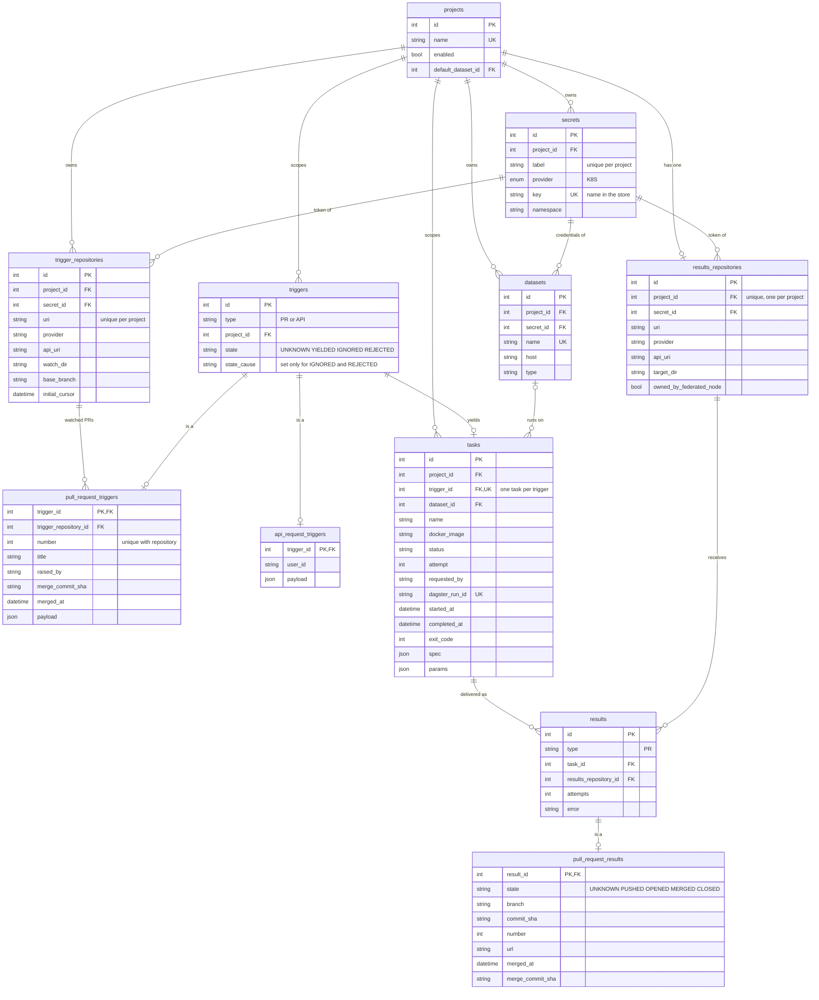
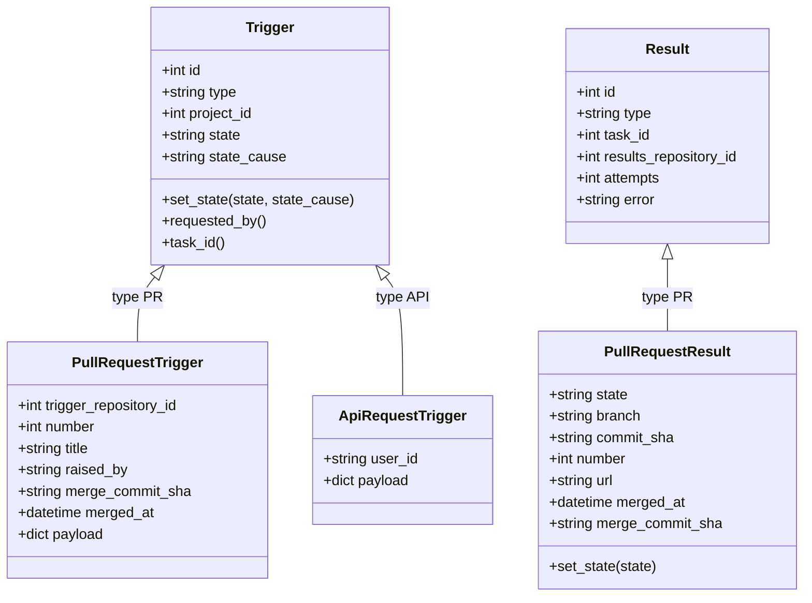
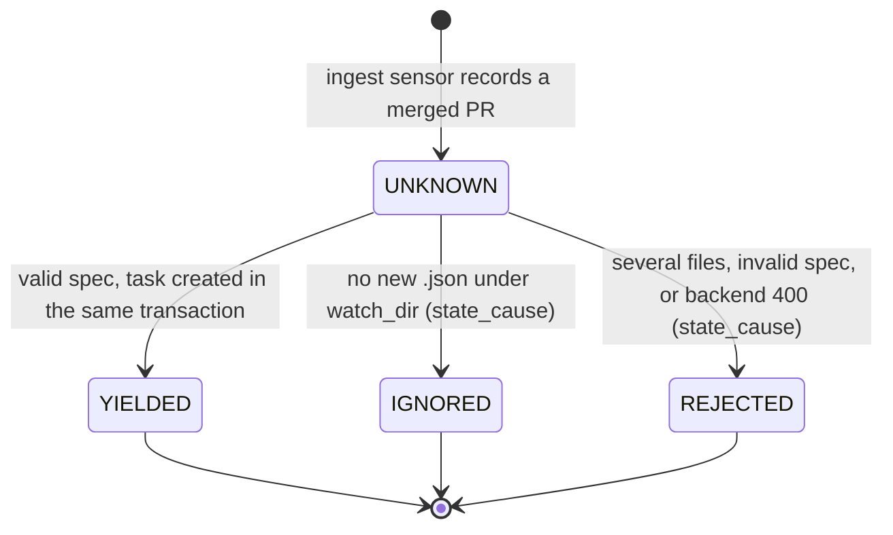
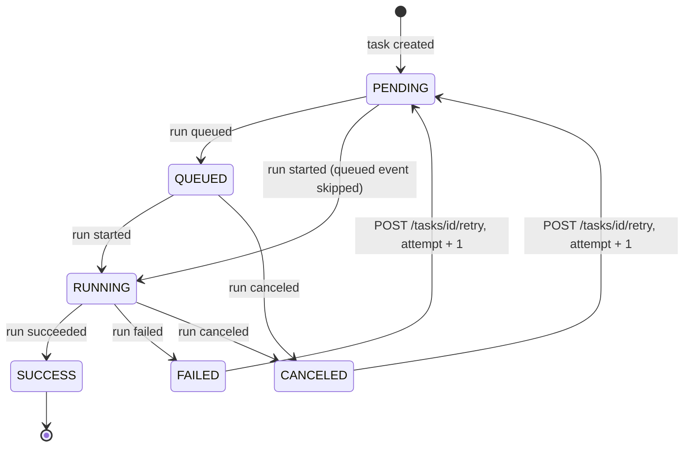
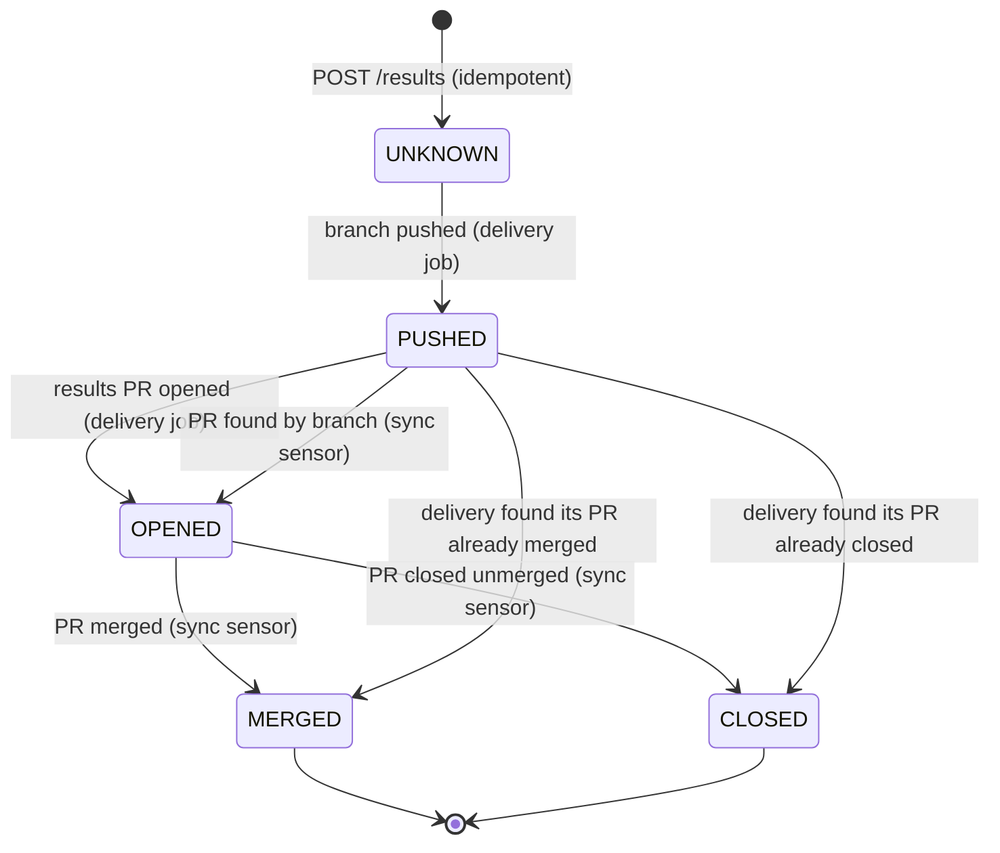

# Entities and state machines

The final backend schema (`webserver/migrations/versions/001_baseline.py`), the two inheritance trees, and the three state machines. Decisions: [0001](../../project/decisions/0001-polymorphic-triggers.md), [0003](../../project/decisions/0003-project-scoped-git-repositories.md), [0008](../../project/decisions/0008-polymorphic-result-and-forward-only-state.md), [0009](../../project/decisions/0009-sync-reconciler-and-operational-rules.md), [0017](../../project/decisions/0017-task-status-written-by-run-status-sensors.md).

Not drawn: `audit`, `registries`, `whitelisted_images`, `catalogues`, `dictionaries`, `dars` (disconnected, [0014](../../project/decisions/0014-dar-rename-and-detached-auth.md)) and `results_backends` (present in the baseline, unused by the pipeline).

## Schema

Composite foreign keys `(project_id, secret_id)` on `datasets`, `trigger_repositories` and `results_repositories` tie each to a secret of its own project. A `results` row is unique per `(task_id, results_repository_id)`. `projects.default_dataset_id` closes a cycle with `datasets` and is added last in the migration.

## Inheritance trees

`state` is on the `Trigger` parent (the verdict is the same for any kind) but on the `PullRequestResult` child (the delivery lifecycle belongs to the delivery kind), see [0008](../../project/decisions/0008-polymorphic-result-and-forward-only-state.md). The trigger side is the merged pull request we watch; the result side is the pull request we open.

## Trigger state

`state_cause` is required for `IGNORED` and `REJECTED` and forbidden otherwise (check constraint and `set_state`). An `ApiRequestTrigger` is validated inside `POST /tasks`: it is recorded `REJECTED` (with the cause) when invalid, else `YIELDED` with its task, and is never `UNKNOWN` for long.

## Task status

Only the run-status sensors write the status; the backend does not enforce the order. Delivery never changes it ([0017](../../project/decisions/0017-task-status-written-by-run-status-sensors.md)).

## PullRequestResult state

Forward only: `UNKNOWN < PUSHED < OPENED < MERGED = CLOSED`. A PATCH to the same state is accepted; to an earlier state, or out of `MERGED`/`CLOSED`, is a 400. A failed delivery leaves the state and sets `error` and `attempts`.
