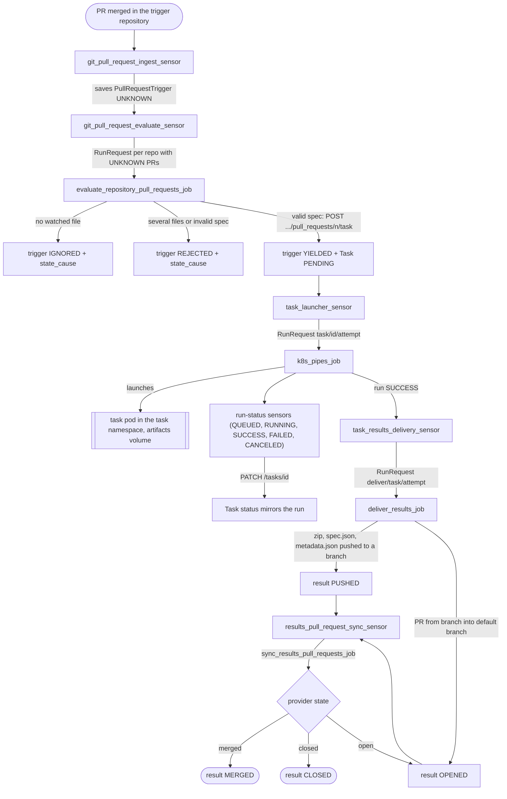
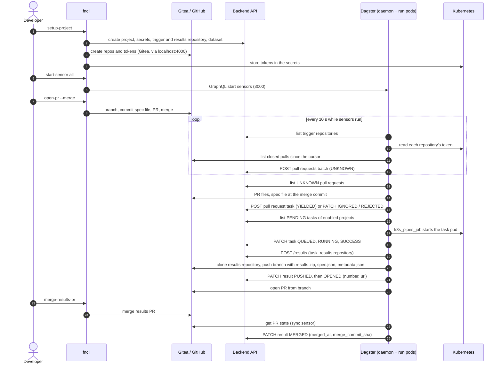
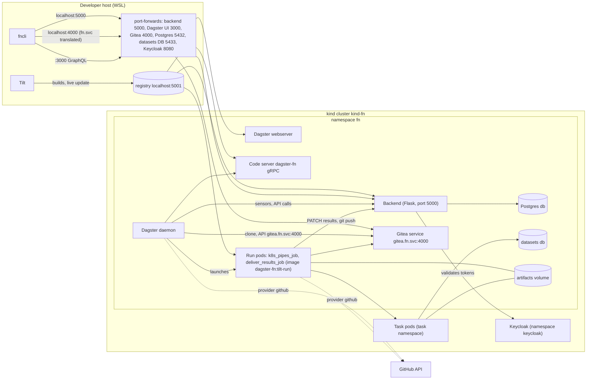

# Flows and components

How a merged pull request becomes a task, a run, and a results pull request. Decisions: [index](../../project/decisions/README.md). Entities and states: [entities.md](entities.md).

## End to end

All sensors are STOPPED by default and started by the operator ([0009](../../project/decisions/0009-sync-reconciler-and-operational-rules.md)). The delivery job only runs after a task run succeeds; a failed delivery is re-launched by hand.

## Sequence across fncli, backend, Dagster and the git host

## Components and network

The run pod (not the daemon) delivers results because it mounts the artifacts volume. Task pods run in `DAGSTER_TASK_NAMESPACE` (default: the release namespace). GitHub is reached over its API only when a repository's provider is `github`.

## Sensor and job inventory

All sensors have `default_status=STOPPED` and a 10 s minimum interval.

| Name | Kind | Watches / reads | Launches or writes | Defined in |
|---|---|---|---|---|
| `git_pull_request_ingest_sensor` | sensor | trigger repositories, provider pulls | saves `PullRequestTrigger` batch (UNKNOWN) | `sensors/git/__init__.py`, `pr_ingest.py` |
| `git_pull_request_evaluate_sensor` | sensor | UNKNOWN pull requests of enabled projects | `evaluate_repository_pull_requests_job` per repository, unless one is in flight | `sensors/git/pr_evaluate.py` |
| `evaluate_repository_pull_requests_job` | job (max 3 concurrent) | UNKNOWN PRs, spec at merge commit | task (YIELDED), or IGNORED or REJECTED with cause; op retries 3x | `sensors/git/evaluate_job.py` |
| `task_launcher_sensor` | sensor | PENDING tasks of enabled projects | `k8s_pipes_job` run, key `task/<id>/<attempt>`, tag `trigger=task` | `sensors/task/launcher.py` |
| `k8s_pipes_job` | job | task spec and dataset (run config) | task pod, artifacts | `definitions/jobs.py`, `pipes.py` |
| `task_queued_sensor`, `task_started_sensor`, `task_success_sensor`, `task_failure_sensor`, `task_canceled_sensor` | run-status sensors on `k8s_pipes_job` | runs tagged `trigger=task` | `PATCH /tasks/<id>` status, run id, times | `sensors/task/run_status.py` |
| `task_results_delivery_sensor` | run-status sensor (SUCCESS) on `k8s_pipes_job` | succeeded task runs | `deliver_results_job`, key `deliver/<task>/<attempt>`, tags `trigger=delivery`, `delivery_task_id` | `sensors/task/delivery.py` |
| `deliver_results_job` | job (run pod) | artifacts volume, task, results repository | branch, results PR, result PUSHED then OPENED | `delivery/results.py`, `git_push.py` |
| `results_pull_request_sync_sensor` | sensor | results PUSHED or OPENED | `sync_results_pull_requests_job` unless in flight | `sensors/task/pull_request_sync.py` |
| `sync_results_pull_requests_job` | job | provider PR state | result OPENED, MERGED or CLOSED, number, url, merge fields | `sensors/task/pull_request_sync.py` |
| `noop_job` | job | nothing | smoke test of the code location and run launcher | `definitions/jobs.py` |
