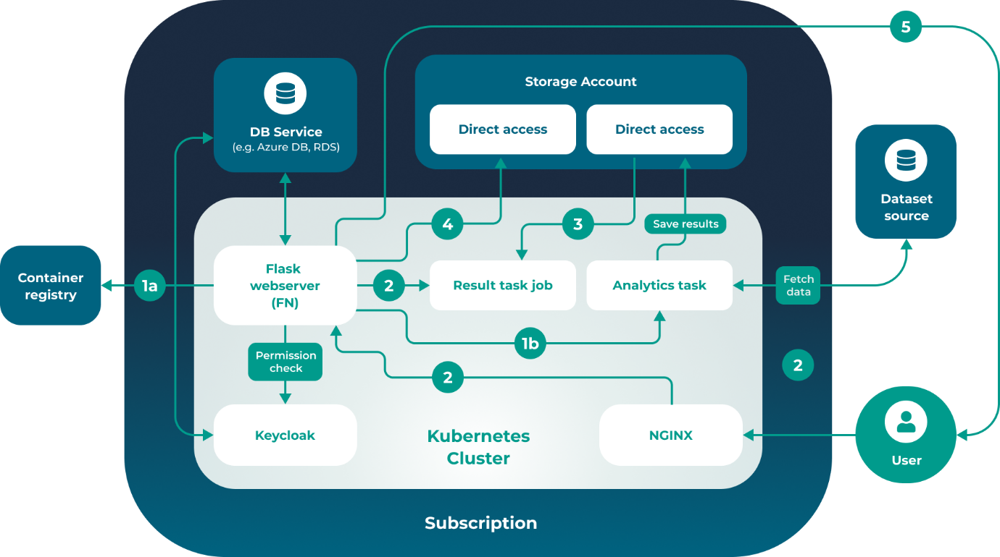
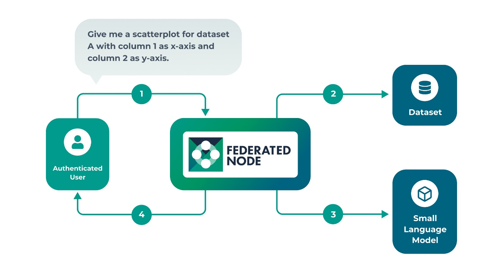

# Summary

The Federated Node is an open-source software component for running
federated analytics. It is based on existing open standards and is
designed to be easy to deploy, manage and integrate with existing
infrastructure within data controllers environment for a wide variety of
data types and use cases. It has been developed for the PHEMS consortium
and is already deployed at multiple partner sites, forming the basis of
their federated data sharing network.

# Statement of Need

Collaborative biomedical and clinical research increasingly depends on
access to diverse, curated real-world data. However, despite progress in
open science and digital health infrastructure, such collaboration
remains fragmented. Data are often siloed across institutions,
jurisdictions, and governance frameworks, particularly in domains such
as rare disease and cancer research where sample sizes are inherently
small and geographically dispersed. Harmonising and analysing these data
collectively are essential for scientific reproducibility and
translational impact [@LegidoQuigley2025].

Efforts to promote open and FAIR (Findable, Accessible, Interoperable,
Reusable) data practices have revealed the natural tension between data
accessibility and usability, and privacy protection. The introduction of
robust privacy legislation such as the EU’s General Data Protection
Regulation (GDPR) and equivalent frameworks worldwide has been vital in
safeguarding individual rights. Yet, the resulting regulatory and
technical fragmentation has made it increasingly difficult for
researchers to move, share, or co-analyse data across national borders
e.g. [@Mourby2019]. The European Health Data Space (EHDS) and
similar policy initiatives recognise that secure federated approaches,
where data remain within their source environments but can be analysed
collectively, are essential to balance privacy with scientific utility.

Federation has therefore emerged as a practical and ethical mechanism
for enabling cross-border research. Rather than copying or aggregating
sensitive datasets into central repositories, federated networks allow
analytical code to be executed remotely under the control of data
custodians, ensuring data never leave institutional boundaries. This
paradigm directly addresses legal and ethical constraints on
cross-border data movement while maintaining auditability and governance
alignment with local policies [@EradatOskoui2025]. The success
of nationwide federated EHR networks in routine emergency-care research
[@Bienzeisler2025] demonstrates that such infrastructures are now
technically feasible and not merely conceptual.

# State of the field
While the technical foundations for federated analytics and learning are
in place, translating them into practice remains challenging. Even
comprehensive frameworks such as the [GA4GH Task Execution Service](https://www.ga4gh.org/product/task-execution-service-tes/) and the
[ICODA Common API](https://github.com/federated-data-sharing/common-api
) cannot, by themselves, overcome the deep heterogeneity that exists in
real-world healthcare systems. Recent reviews of federated learning in
medicine emphasise that most studies still fail to reach clinical
utility, citing issues such as non-identical data distributions,
methodological bias, heavy communication overheads, and incomplete
governance alignment [@Li2025;@Joshi2022]. A recent
systematic review found that of more than 22,000 papers screened, fewer
than 6 per cent involved genuine real-world deployments, underscoring
persistent barriers to clinical translation [@Teo2024].
Large-scale national programmes such as Australian Genomics further
highlight the operational and governance coordination required even
before federated analytics are introduced [@Stark2023]. These
findings collectively illustrate that while federation is technically
feasible, its successful implementation demands lightweight,
standards-aligned infrastructure that reduces operational friction and
lowers the barrier for adoption.

Despite these advances, establishing and maintaining interoperable
federated networks remains complex. Implementations often require
substantial local customisation to integrate with existing
authentication, container orchestration, and registry systems. There is
therefore a pressing need for an open, reproducible, and lightweight
reference implementation that lowers the barrier for organisations to
participate in federated research while adhering to the GA4GH Task
Execution Service (TES) specification.

The Federated Node (FN) addresses this need by operationalising the
ICODA Common API into a deployable, open-source package built from
widely adopted components (Keycloak, nginx, PostgreSQL, Kubernetes). FN
allows institutions to host secure, standards-compliant endpoints
capable of executing authorised analytical tasks against local datasets,
thereby enabling scalable, privacy-preserving, cross-institutional
collaboration aligned with international standards.

By operationalizing existing specifications rather than creating proprietary approaches, the FN lowers adoption barriers while ensuring interoperability, as demonstrated by deployment across four European countries with heterogeneous infrastructure as described following.

# Research Impact Statement
The FN is deployed in production across multiple sites within the [PHEMS](https://phems.eu) (Pediatric Hospitals as European drivers for multi-party computation and synthetic data generation) consortium, enabling the first operational federated analytics network spanning currently four pediatric hospitals across Europe. The PHEMS deployment demonstrates impact, with participating institutions are now actively executing federated queries against real clinical dataset for clinical benchmarking.

The modular design of the FN has enabled integration with existing institutional infrastructure across different technology stacks, demonstrating practical interoperability rather than requiring platform homogeneity. 

# Software Design
The International Covid-19 Data Alliance ([ICODA](https://icoda-research.org/ICODA)) developed the [Federated Data Sharing Common API](https://github.com/federated-data-sharing/common-api) or "Common API" as an open standard for a federated data sharing API, as described elsewhere. The Common API is a constrained implementation of the Global Alliance for Genomics and Health [Task Execution Service](https://www.ga4gh.org/product/task-execution-service-tes/), containing components for meta-data browsing, remote data selection and federated computation.

The Federated Node (FN) builds upons this open standard, and provides a
practical, working implementation of the standard that can be easily
deployed and operated into federated research networks. The FN packages
an implimention of the Common API with other opensource components
including :

- The Common API
- [Keycloak](https://www.keycloak.org/)
- [nginx](https://nginx.org/)

The Common API specifies a set of endpoints that provide a framework for organisations that wish to collaborate on federated data sharing and analysis. It provides the structure of the Federated Node API.

Keycloak is used for token and user management, and nginx is used as a
reverse proxy, to route incoming requests.

Federated Node deployments are lightweight and use common technologies.
Federated Nodes are deployed to a Kubernetes cluster and require a
Postgres database for storing user credentials. A deployed Federated
Node also needs to be associated with a container registry. This is used
to store the remote tasks that are run against the data.

\autoref{fig:figure1} below describes how a federated task is processed when
initiated by an authenticated user:

- *1a* Before creating the task pod, the FN checks if the docker image
  needed can be found in the azure container registries associated with
  the FN.

- *1b* The task pod is created, and the results are saved in the
  storage account.

- *2* On /results calls, if the task pod is on completed status, a job
  is created.

- *3* The job’s pod will have the 2 storage environments mounted. It
  fetches the tasks result folder and zips it.

- *4* The webserver reads the zip contents from the live job pod and
  saves it in its own storage account environment.

- *5* The resulting archive is returned to the end user

This architecture gives the data owner full control over what code is
run against their data, as only scripts stored in the associated
container registry can be used, and only authenticated users have the
ability to initiate federated tasks.

## Extension to support AI

The Federated Node AI is a fork of the main FN project. It introduces an
additional endpoint/ask for submitting prompts to a deployed small
language model (SLM).

In this configuration instead of retrieving analytical code from an
associated container registry the FN is deployed with an LLM or SLM
hosted in the same environment as the federated data. Authenticated
users can perform federated analysis by sending prompts to the remote
SLM, as illustrated following in \autoref{fig:figure2}.

- *1* User submits prompt e.g. Give me a scatter plot for dataset A, with
    column 1 as X-axis and column 2 as y-axis
- *2* Federated Node retrieves the data
- *3* Data and prompt are sent to the SLM
- *4* Task is complete and results are returned to the user

By default the FN also retains the last 10 interactions between the
users and the SLM providing context when the user wants the SLM to
iterate its analysis. Other than these limited additions the FN AI
retains the design of the standard Federated Node detailed above.

There are obvious benefits to this approach, primarily that it lowers
the barrier to entry for users with limited coding skills. However, we
accept that there are a significant issues that need to be resolved
before this approach can be considered secure and scalable and that the
issues around LLM security and reliability, particularly with regards to
mathematical reasoning, are well established. This is not to mention the
costs associated with running these models in the data owners
infrastructure. Our underlying assumption is that these problems will be
resolved by two developments:

1.  Smaller, more specialised, and more efficient language models.

2.  The emergence of mature workflow patterns, including security and
    output checks, for the use of language models in data analysis to
    prevent data exfiltration through prompt engineering.

# PHEMS

Authors from the PHEMS ("Pediatric Hospitals as European drivers for multi-party computation and synthetic data generation capabilities across clinical specialities and data types") project are:

- Valts Abols, Children's University Hospital Latvia
- Lydia Briggs, Great Ormond Street Hospital
- Patricia Garcia Cañadilla, Sant Joan de Déu Barcelona Hospital 
- Beatrice Casarella, Meyer Children's Hospital
- Marinel Cavelaars, The Hyve 
- Bruno De Brito Robalo, Erasmus University Medical Centre
- Teemu Ekola,  Tietoevry
- Roger Domingo Espinos, Sant Joan de Déu Barcelona Hospital
- Arnau Valls Esteve, Sant Joan de Déu Barcelona Hospital
- Josep Lluís Falcó, Genesis Biomed 
- Eric Fey, HUS Helsinki University Hospital
- Janne Hämäläinen, Tietoevry
- Tiia Hautaniemi, HUS Helsinki University Hospital
- Liisa Henriksson, HUS Helsinki University Hospital
- Cristina Ruiz Herguido, Sant Joan de Déu Barcelona Hospital
- Riku Hietaniemi, Tietoevry
- Mikko Juvonen, HUS Helsinki University Hospital
- Nora Kaufmane, Children's University Hospital Latvia 
- Pekka Kahri, HUS Helsinki University Hospital 
- Jari Kautiala, Tietoevry
- Daniel Key, Great Ormond Street Hospital 
- Daniel Ormazabal Kirchner, Sant Joan de Déu Barcelona Hospital
- Signe Koritko, Children's University Hospital Latvia
- Jan Willem Kuiper, Erasmus University Medical Centre
- Satu Långström, HUS Helsinki University Hospital
- Gary Zhen Yuan Liew, Great Ormond Street Hospital
- Ron Mathot, Amsterdam University Medical Centre
- Kathleen McGreevy, Meyer Children's Hospital
- Jennifer McIntosh, Sant Joan de Déu Barcelona Hospital 
- Ruben Berrueco Moreno, Sant Joan de Déu Barcelona Hospital 
- Claudia Ibabe Muñoz, Sant Joan de Déu Barcelona Hospital 
- Tomi Mustonen, Tietoevry
- Daniel Nguyen, Veil AI 
- Ieva Poča, Children's University Hospital Latvia
- Inese Gobiņa, Children's University Hospital Latvia
- Antti Saarela, Tietoevry
- Jordi Ortiz Sagrista, Genesis Biomed
- Jonna Salminen, HUS Helsinki University Hospital 
- Hannele Salonen, HUS Helsinki University Hospital
- Nikolas Salonen, HUS Helsinki University Hospital 
- Dace Ševčenko, Children's University Hospital Latvia
- Ignus Sinkovski, Children's University Hospital Latvia
- Ieva Studente, Children's University Hospital Latvia 
- Azadeh Tafreshiha,The Hyve 
- Andrew Taylor, Great Ormond Street Hospital 
- Jan van den Brand, Erasmus University Medical Centre 
- Aida Felipe Villalobos, Sant Joan de Déu Barcelona Hospital
- Anniina Wäyrynen, Veil AI

# Author contributions
R.C. and R.S. designed and developed the software.  S.R., R.B. and D.S provided oversight of the project. PHEMS contributed use cases that informed requirements and validation. All authors contributed to the writing and/or review of the manuscript.

# AI usage disclosure
All code was written by the development team through conventional software engineering practices. Documentation and this manuscript were authored directly by the listed contributors without AI assistance.  Generative AI tools were used as part of the testing and deployment of the AI Federated Task extension. 

# Acknowledgements
We would like to thank the following people for their contributions to
the Federated Node project: Hepzibah Faustina and Marco Luk for their
assistance testing and deploying the FN; George Eddie, Ross Hannah,
Finlo Boyle, Chi-Hao Huang for their code reviews and oversight; Eoghan
Forde and Deepak Sehgal for project management support; and Matt Western
and Daniel Morris for their assistance in preparing the paper.

# References
