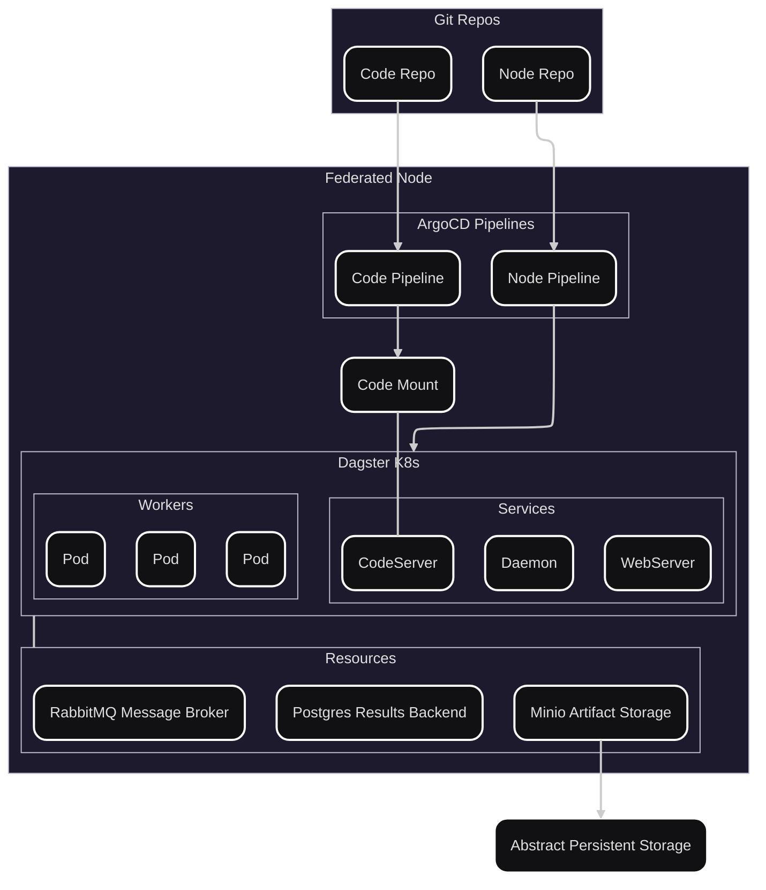

# ADR 001: Dagster Orchestration Framework

## Status
Proposed

## Context
The **PHEMS framework** is designed as an open-source **federated orchestration layer** for highly regulated domains such as healthcare.
It balances operational efficiency with strict compliance requirements through modular components, auditable workflows, and secure execution patterns.

This ADR focuses on the **Dagster-based orchestration architecture within a single federated node**.
Federation and MLflow integration are mentioned only for contextual completeness, but **this document concerns the single-node deployment model**.

---

## Architecture Overview

### Dagster Orchestration
- Unified control plane for teams to build, scale, and observe AI and data pipelines in Python.
- Modular and configurable: storage, sensors, schedules, executors, and logging are pluggable.
- Provides reproducibility and auditability without the operational complexity of Kubeflow or Airflow.
- Defines jobs and assets declaratively, enabling lineage tracking and deterministic execution.

### Workers and Celery
- Enables horizontal scaling without centralizing compute or exposing sensitive data outside the node.
- Workers are Kubernetes pods executing user-defined tasks (ops, jobs, or asset materializations) as Kubernetes Jobs.
- Celery provides distributed asynchronous execution using message brokers such as RabbitMQ.
- This model supports concurrent workloads while maintaining strict isolation between projects.

### MLflow
- Provides experiment tracking and model registry capabilities across nodes.
- Tracks parameters, metrics, and artifacts for lineage and reproducibility.
- Serves as a unified interface for audit and traceability in distributed training workflows.
- Integrated with Dagster metadata for linking runs, assets, and experiments.

### Federated Design
- Each **Data Controller** (e.g., hospital or research site) operates a **self-contained node** with Dagster, Celery workers, and shared resources.
- Sensitive data remains siloed; only approved artifacts or model updates are shared.
- This ensures compliance with privacy regulations while enabling collaborative learning.

---

## Architecture

### Components
- **Dagster WebServer** - Centralized UI and GraphQL API for run orchestration, logs, and asset lineage.
- **Dagster Daemon** - Executes background processes such as schedules, sensors, and backfills.
- **CodeServers** - gRPC servers hosting isolated Dagster definitions per project or tenant.
- **Worker Pools** - Dagster-Celery-K8s executors that handle parallel job execution.
- **Shared Resources** - Common infrastructure such as Postgres (metadata), MinIO (storage), and RabbitMQ (broker).
- **MLflow Service** - Optional component for experiment and model tracking within the node.

---

## Key Properties
- **Isolation** - Each project runs in its own Dagster code location with isolated runtime boundaries.
- **Scalability** - Kubernetes Jobs and Celery queues enable parallel, fault-tolerant execution.
- **Observability** - Centralized logging, metrics, and lineage visualization via Dagster UI.
- **Reproducibility** - Declarative asset definitions ensure deterministic and auditable execution.
- **Extensibility** - Built to integrate with MLflow and federated orchestration layers without refactoring core pipelines.

---

## Shortcomings of Current Project
The current [`PHEMS_federated_node`](https://github.com/Aridhia-Open-Source/PHEMS_federated_node) implementation lacks a structured orchestration and execution framework.
While it provides a minimal deployment and service baseline, several core capabilities are missing:

- No unified orchestration or task queue framework for managing dependencies, retries, and scheduling.
- Execution flows are ad-hoc scripts without standardized asset or job definitions.
- Absence of an internal message broker or background queue system (e.g., Celery + RabbitMQ) for concurrent workloads.
- No automated lineage tracking, run metadata storage, or observability tools for auditability.
- Lacks a declarative model for defining jobs, sensors, or schedules within a controlled execution environment.
- Governance hooks (e.g., approvals, controlled result promotion) are not integrated at the orchestration layer.
- Scaling and multi-project coordination require manual operational intervention.

These limitations make the current architecture brittle and difficult to scale or govern.
Introducing Dagster with Celery workers and shared infrastructure provides a standardized orchestration layer, enabling scalability, reproducibility, and compliance.

---

## Consequences

**Benefits**
- Strong alignment with compliance and governance requirements.
- Modular and scalable orchestration architecture for both single-node and federated use cases.
- Simplifies CI/CD and GitOps integration for reproducible deployments.
- Enables local autonomy with the option for federated coordination later.
- Provides explicit lineage and metadata tracking across all assets and runs.
- Supports concurrent, fault-tolerant workloads through queue-based execution.
- Facilitates clearer separation of compute, governance, and infrastructure concerns.
- Reduces manual coordination overhead for scheduling, triggering, and publishing tasks.
- Improves auditability and observability with built-in Dagster tooling.
- Offers Python-native extensibility for integrating MLflow, data validation, and compliance checks.

**Trade-offs**
- Slightly higher operational complexity compared to lightweight script-based orchestration.
- Requires management of additional Dagster components (WebServer, Daemon, CodeServers).
- Introduces dependency on Celery and RabbitMQ, which must be maintained and monitored.
- Demands stricter configuration discipline to preserve reproducibility and determinism.
- Increases learning curve for developers unfamiliar with Dagster's asset-based paradigm.
- Adds deployment complexity for multi-project environments due to multiple gRPC code locations.
- Requires integration of CI/CD policies and GitOps practices to realize governance benefits.

---

## Alternatives Considered

| Alternative | Reason Rejected |
|--------------|----------------|
| **Airflow** | Workflow-oriented, lacks modern asset-based abstractions and strong data lineage. |
| **Prefect** | Less mature Kubernetes integration, limited support for multi-location isolation. |
| **Kubeflow** | Overly complex for compliance-focused deployments; heavy operational overhead. |
| **Luigi** | Not actively maintained for distributed, scalable workloads. |

---

## Summary
Dagster provides a composable, auditable, and reproducible orchestration foundation for **single-node deployments** within the PHEMS framework.
While the long-term goal includes federation and MLflow integration, the immediate priority is to establish a robust local orchestration layer that enforces governance, reproducibility, and compliance.
