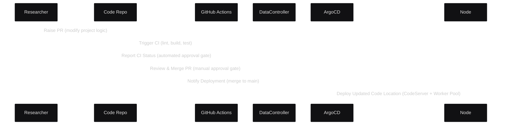
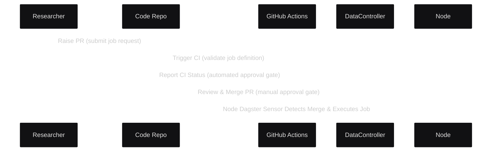
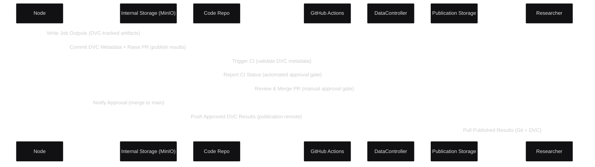
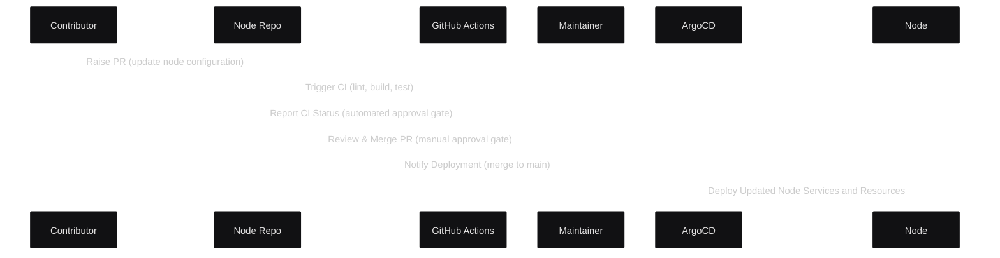
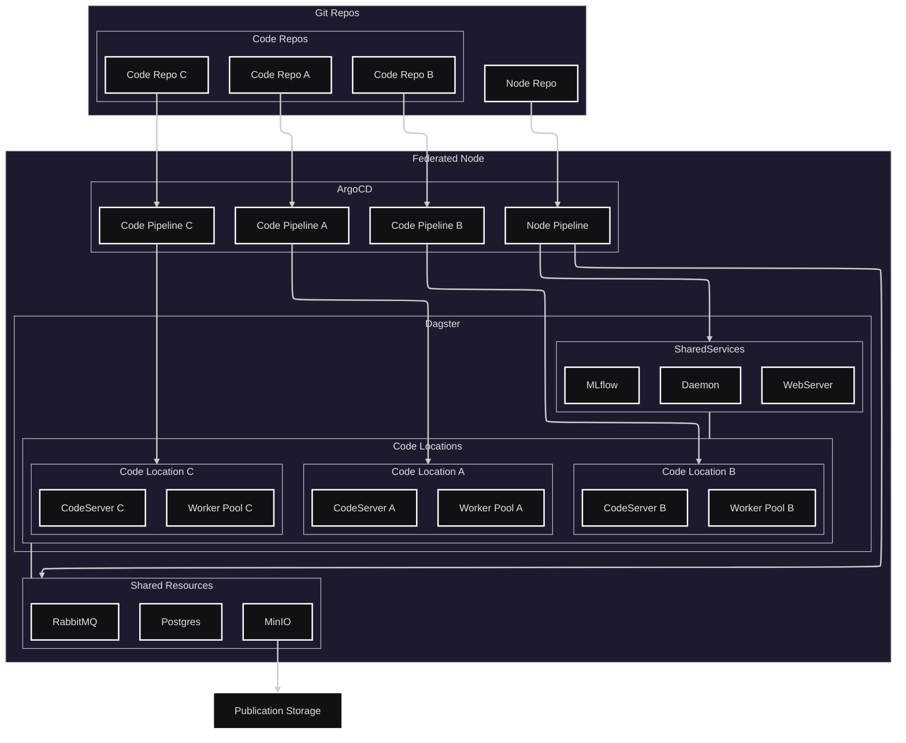

# ADR 003: GIT Repository Governance

## Status
Proposed

## Context
Originally, the system used a single monolithic repository where both governance, and execution logic were all defined together. In this design, merging to the main branch triggered deployment and job execution in one continuous flow. While simple at first, this approach does not provide adequate seperation of concerns and will not scale as the platform is expanded to support multiple projects (use-cases) and federated nodes.

## Decision

To improve modularity, scalability, and operational clarity, the design has been refactored to introduce two distinct repositories.
This separation allows multiple projects (Code Repos) to coexist on a single node while maintaining independent CI/CD workflows and governance controls.
- **Node Repo** defines the shared base infrastructure, resources, and services for the federated node and can support many code locations
- **Code Repo** defines a single project's compute and governance logic, deployed as one Dagster code location (CodeServer + Worker Pool) on a node.

---

## Structure

### Code Repo
Defines the **compute** and **governance** layers for a project.
Deployed as a single Dagster code location consisting of a CodeServer and Worker Pool.

**Contents:**
- **Dagster definitions** (assets, jobs, schedules, sensors, resources)
- **Execution environments** (Dockerfiles, Python requirements, Celery config)
- **Governance control flows** (PR-based job submission, result publication)
- **Infrastructure manifests** (Helm charts, ArgoCD descriptors)

---

## Workflows

### Node Repo

#### Code Change

1. **Researcher** raises a PR to modify or extend the project logic.
2. **GitHub Actions** executes the CI pipeline (lint, build, test).
3. **Data Controller** reviews and merges the PR to authorize deployment.
4. **ArgoCD** deploys the updated code location (CodeServer + Worker Pool) to the node.

---

#### Job Submission

1. **Researcher** raises a PR to the `jobs/` directory defining a job request.
2. **GitHub Actions** validates schema and dependencies.
3. **Data Controller** reviews and merges the PR to authorize execution.
4. **Node’s Dagster sensor** detects the merge and triggers job execution.

---

#### Result Publication

1. **Node** writes job outputs to internal MinIO storage.
2. **Node** commits DVC metadata for tracked artifacts and raises a PR.
3. **GitHub Actions** validates the PR contents (automated gate).
4. **Data Controller** merges PR to authorize result publication.
5. **Node** pushes approved artifacts to publication storage via DVC.
6. **Researchers** retrieve approved results using Git + DVC from the publication remote.

---

### Node Repo

### Code Change

Defines the **shared infrastructure** and **services** used by all deployed code locations within a node.

**Contents:**
- Helm charts and ArgoCD manifests
- Resource definitions (Postgres, RabbitMQ, MinIO)
- Service configurations (WebServer, Daemon, MLflow)
- Environment variables and secrets management

**Workflow:**
1. **Contributor** raises a PR to modify node configuration.
2. **GitHub Actions** executes CI (lint, build, test).
3. **Maintainer** reviews and merges the PR to authorize deployment.
4. **ArgoCD** applies the changes to the node environment.

---

## Architecture

## Consequences

**Benefits**
- Decouples shared node infrastructure from project-specific logic.
- Enables independent deployment lifecycles for each project.
- Improves governance transparency via PR-gated workflows.
- Reduces blast radius of project-level changes.

**Trade-offs**
- Slightly increased repository management overhead.
- Occasional coordination required between node and code deployment schedules when updating shared dependencies.
